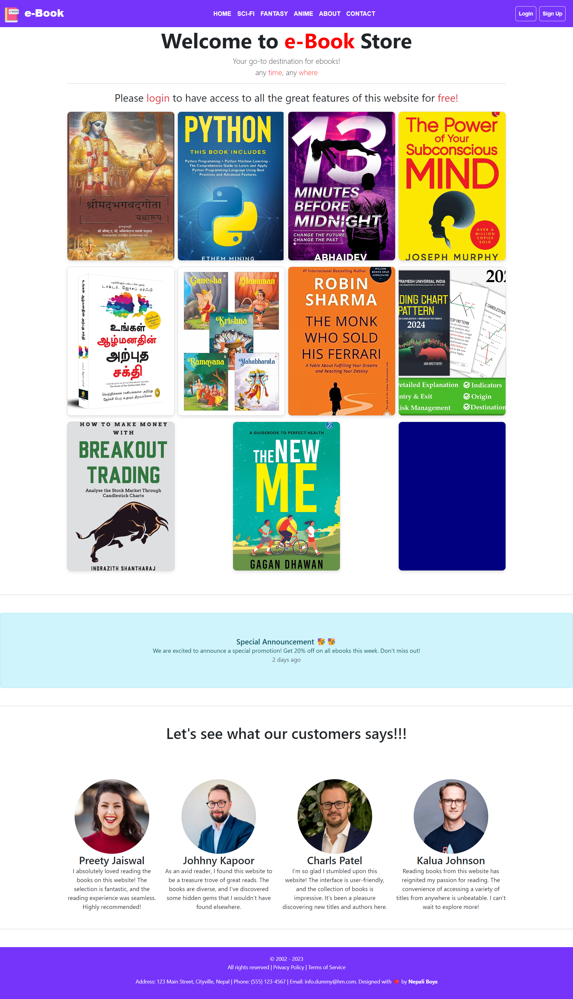
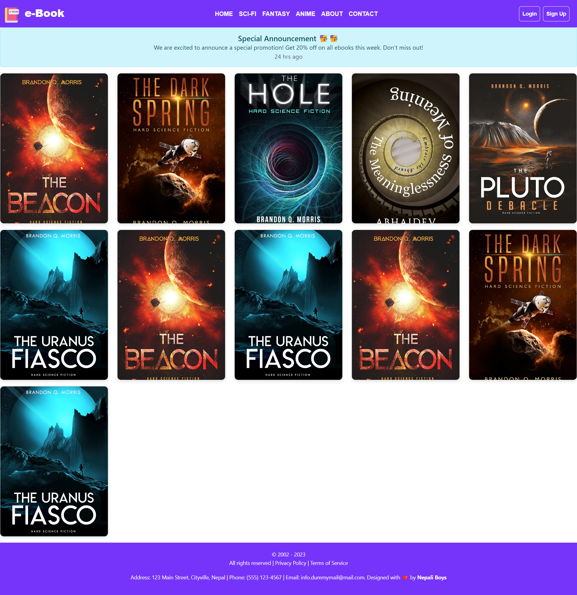
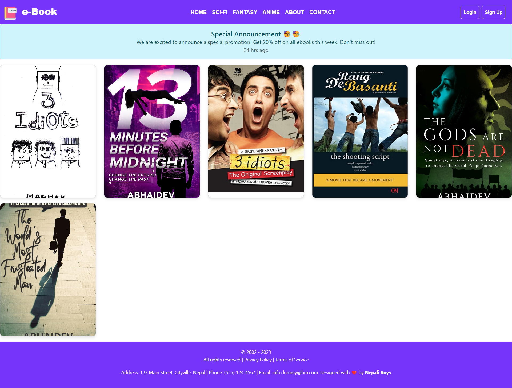
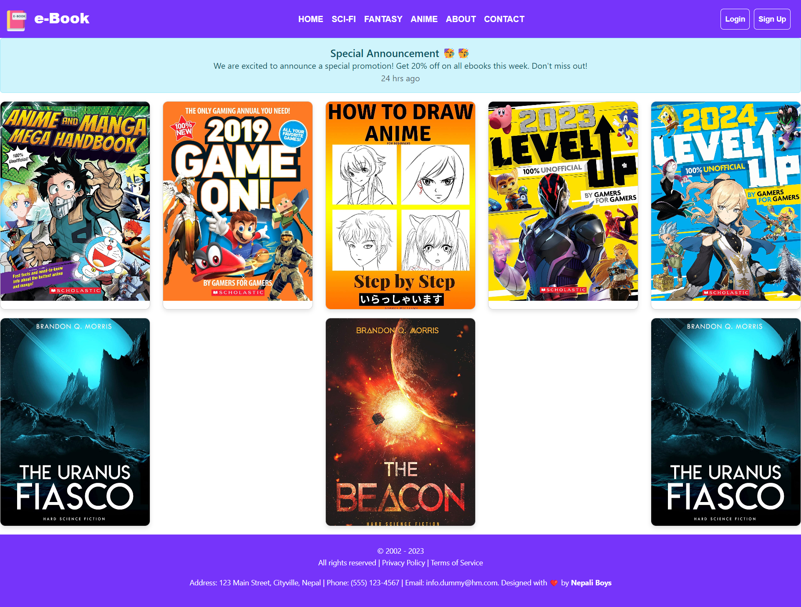
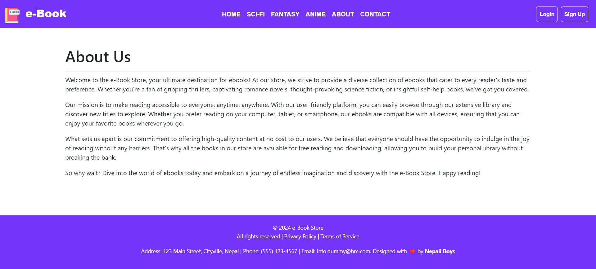
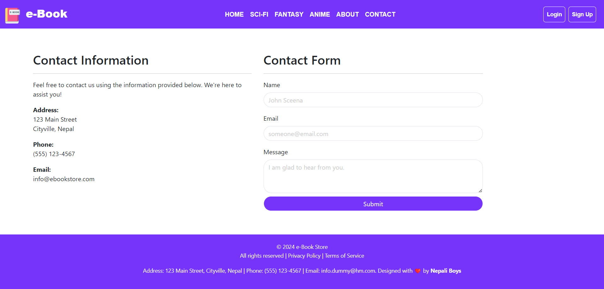
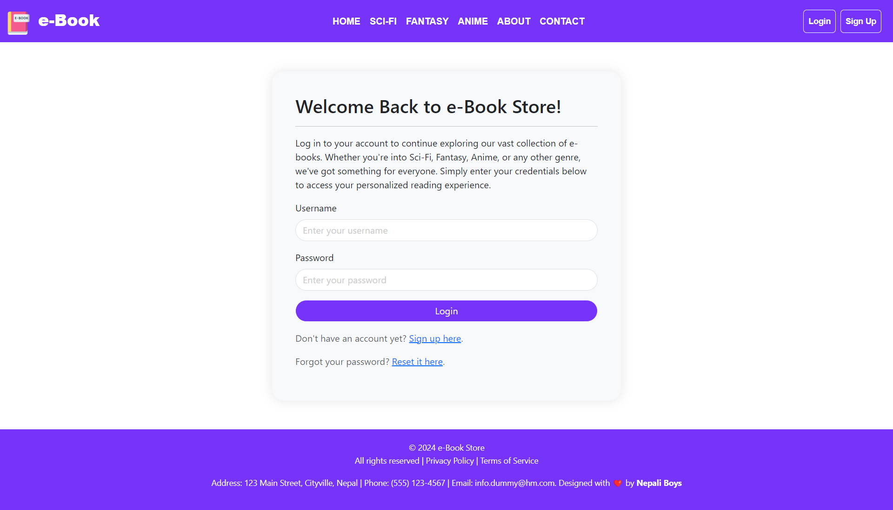
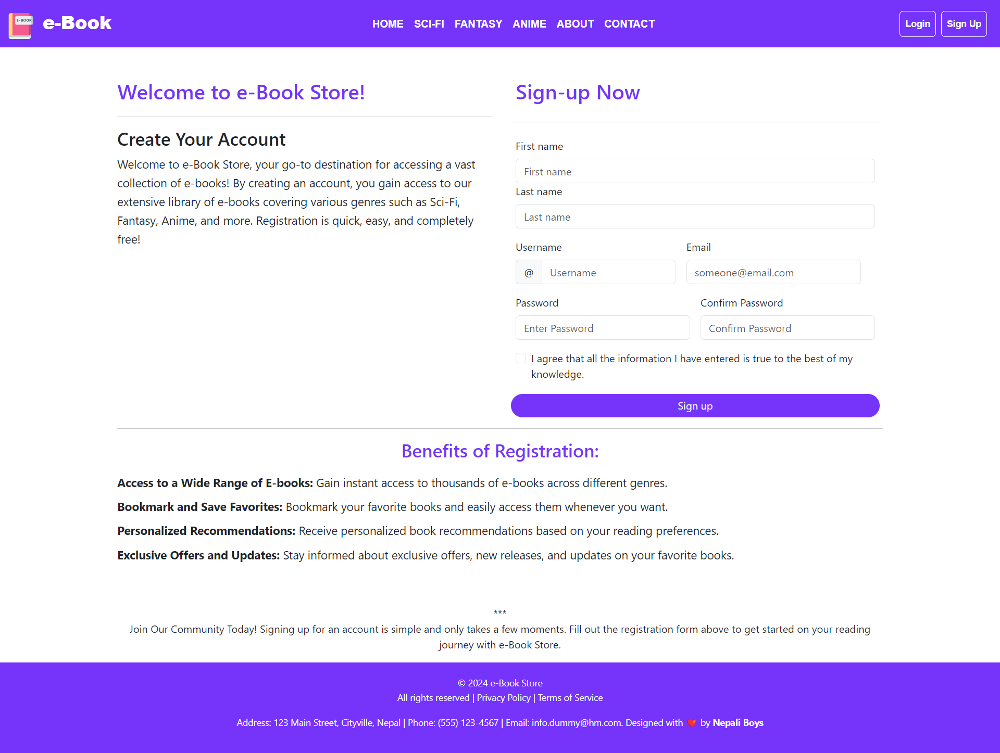

<p align="center">
  
</p>

# 
<h1 align="center">🚀 e-Book - Online Book Store Any Time,Any Where 👩‍💻</h1>
Welcome to the e-Book Store, your go-to destination for ebooks! This web application, built with Django, HTML, and CSS, offers a seamless and user-friendly experience for readers of various genres. Whether you love sci-fi, fantasy, or anime, this platform has something for everyone.

<!-- 
  
   
  
    -->

## Demo Images

### Homepage


### Sci-Fi Section


### Fantasy Section


### Anime Section


### About Page


### Contact Page


### Login Page


### Sign Up Page



## Description
This project is a web application for an eBook platform built using Django. It provides users with access to a collection of eBooks categorized by genre, allowing them to read summaries and explore available titles. Users can register, log in, and view books, with plans to implement features for reading full eBooks and interacting with the community. The application is designed with a responsive layout and includes features such as user authentication, dynamic content loading, and a clean user interface.

## Features

- **User Authentication**: 
  - Login page
  - Sign-up page
- **Navigation Bar**: 
  - Different sections for Sci-Fi, Fantasy, and Anime
- **Book Showcase**: 
  - Display of popular books on the homepage
- **Special Announcements**: 
  - Section for special promotions and announcements
- **Customer Reviews**: 
  - Testimonials from satisfied users

## Homepage Overview

The homepage features a vibrant and welcoming interface with the following sections:

- **Header**: 
  - Logo and navigation bar with links to different book categories
  - Login and Sign-up buttons
- **Main Section**: 
  - A banner inviting users to login for full access
  - A showcase of popular books with thumbnails
- **Special Announcement Banner**: 
  - Information about current promotions and special offers
- **Customer Testimonials**: 
  - Reviews from happy customers, highlighting their experiences

## 🛠 Tech Stack

- **Backend**: Django
- **Frontend**: HTML, CSS


## Setup Instructions

1. **Clone the repository**:
    ```bash
    git clone https://github.com/its-maneeshk/e-book-store.git
    cd e-book-store
    ```

2. **Create a virtual environment**:
    ```bash
    python -m venv venv
    source venv/bin/activate   # On Windows, use \`venv\\Scripts\\activate\`
    ```

3. **Install dependencies**:
    ```bash
    pip install -r requirements.txt
    ```

4. **Apply migrations**:
    ```bash
    python manage.py migrate
    ```

5. **Create a superuser**:
    ```bash
    python manage.py createsuperuser
    ```

6. **Run the development server**:
    ```bash
    python manage.py runserver
    ```

7. **Access the application**:
    Open your browser and go to \`http://127.0.0.1:8000/\`

## Color Reference

| Color             | Hex                                                                |
| ----------------- | ------------------------------------------------------------------ |
| Header |  #0a192f |
| Body |  #f8f8f8 |
| Footer |  #00b48a |

## Future Enhancements

- **Advanced Search Functionality**: Implementing a search feature to find books by title, author, or genre.
- **User Profiles**: Allowing users to create and manage their profiles, including book preferences and reading history.
- **Book Recommendations**: Suggesting books to users based on their reading history and preferences.
- **Social Sharing**: Enabling users to share their favorite books on social media platforms.

## Contributing

We welcome contributions from the community. If you would like to contribute, please follow these steps:

1. Fork the repository
2. Create a new branch (\`git checkout -b feature-branch\`)
3. Make your changes
4. Commit your changes (\`git commit -am 'Add new feature'\`)
5. Push to the branch (\`git push origin feature-branch\`)
6. Create a new Pull Request


## Feedback

If you have any feedback, please reach out to us at maneeshkurmii@gmail.com
 
## Lessons Learned

While developing this project, I learned several important aspects of web development:

User Authentication and Authorization: Implementing a secure authentication system using Django's built-in features was crucial to ensure that only authorized users could access certain parts of the website. I faced challenges in managing user sessions and permissions effectively but overcame them by carefully configuring Django's authentication settings and using decorators to restrict access to specific views.

Database Management: Designing an efficient database schema to store information about books, users, and their interactions was essential. I learned to use Django's ORM to define models and establish relationships between them. Optimizing database queries and ensuring data integrity were ongoing challenges that I addressed through careful indexing and query optimization techniques.

Frontend Design and Responsiveness: Designing a visually appealing and responsive frontend interface using HTML, CSS, and JavaScript was another key aspect of the project. I encountered challenges in ensuring consistent styling across different browsers and screen sizes but addressed them by using CSS frameworks like Bootstrap and implementing responsive design principles.

Content Management: Managing a large collection of e-Books, including uploading, organizing, and displaying them on the website, required careful planning and implementation. I learned to use Django's file handling capabilities and created custom management commands to automate tasks such as importing book data from external sources.

Security Considerations: Ensuring the security of the application against common web vulnerabilities such as Cross-Site Scripting (XSS) and Cross-Site Request Forgery (CSRF) was a top priority. I implemented security best practices such as input validation, CSRF protection, and escaping user-generated content to mitigate these risks.

Overall, building this project was a valuable learning experience that helped me improve my skills in web development, database management, and security practices.

## Contact
If you have any questions or feedback, feel free to reach out:

- [Twitter](https://twitter.com/@its_maneeshk_)
- [LinkedIn](https://www.linkedin.com/in/itsmaneeshk/)
- [Email](mailto:maneeshkurmii@gmail.com)
