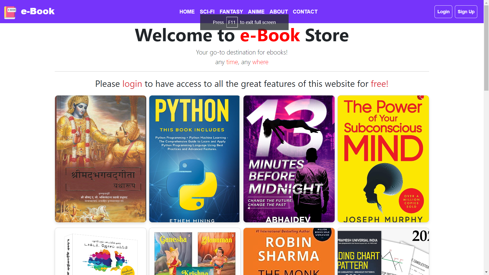
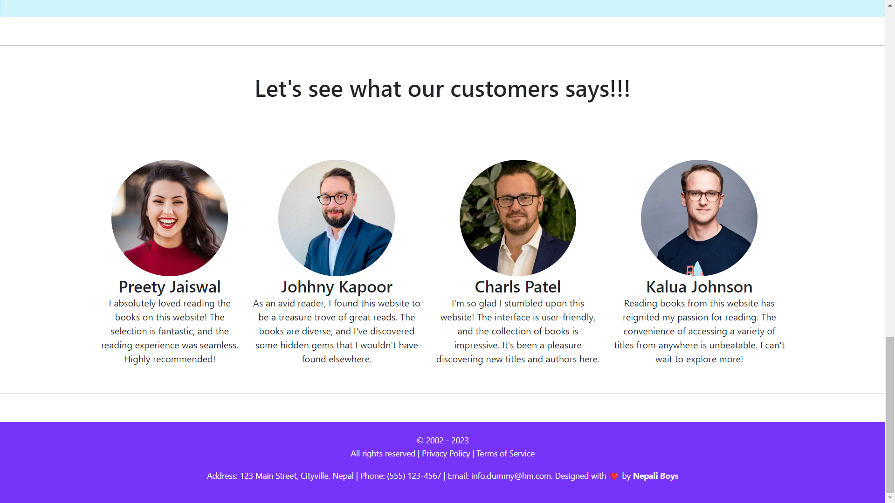
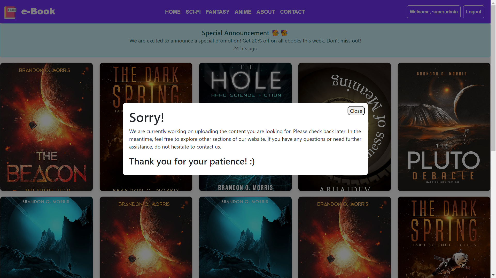
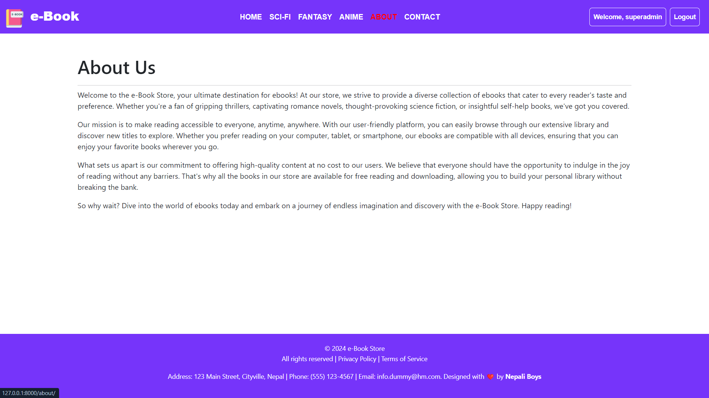
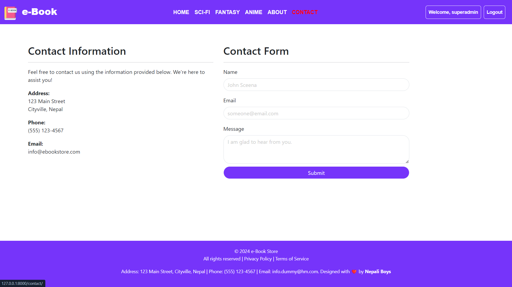

<p align="center">
  
</p>

# 
<h1 align="center">🚀 e-Book - Online Book Store Any Time,Any Where 👩‍💻</h1>


<p align="center">
  
   
</p>
<p align="center">
  
   
</p>

## Description
This project is a web application for an eBook platform built using Django. It provides users with access to a collection of eBooks categorized by genre, allowing them to read summaries and explore available titles. Users can register, log in, and view books, with plans to implement features for reading full eBooks and interacting with the community. The application is designed with a responsive layout and includes features such as user authentication, dynamic content loading, and a clean user interface.

## Features

- Admin Panel: Access an intuitive administrative interface to manage the application's settings, users, and content effortlessly.
- User Creation: Enable users to create accounts securely, allowing them to personalize their experience and access exclusive features.
- Fullscreen Mode: Enjoy an immersive reading experience by toggling to fullscreen mode, maximizing focus and minimizing distractions.
- Cross-platform Compatibility: Access the application seamlessly across different devices and operating systems, ensuring a consistent experience for all users.

## Color Reference

| Color             | Hex                                                                |
| ----------------- | ------------------------------------------------------------------ |
| Header |  #0a192f |
| Body |  #f8f8f8 |
| Footer |  #00b48a |


## Deployment

To deploy this project run command in Command Prompt
```bash
  pip install django
  python manage.py runserver - To start server
  python manage.py createsuperuser - To create the super user 
```


## Feedback

If you have any feedback, please reach out to us at maneeshkurmii@gmail.com


## 🛠 Skills
Django, Javascript, HTML, CSS...

    
## Lessons Learned

While developing this project, I learned several important aspects of web development:

User Authentication and Authorization: Implementing a secure authentication system using Django's built-in features was crucial to ensure that only authorized users could access certain parts of the website. I faced challenges in managing user sessions and permissions effectively but overcame them by carefully configuring Django's authentication settings and using decorators to restrict access to specific views.

Database Management: Designing an efficient database schema to store information about books, users, and their interactions was essential. I learned to use Django's ORM to define models and establish relationships between them. Optimizing database queries and ensuring data integrity were ongoing challenges that I addressed through careful indexing and query optimization techniques.

Frontend Design and Responsiveness: Designing a visually appealing and responsive frontend interface using HTML, CSS, and JavaScript was another key aspect of the project. I encountered challenges in ensuring consistent styling across different browsers and screen sizes but addressed them by using CSS frameworks like Bootstrap and implementing responsive design principles.

Content Management: Managing a large collection of e-Books, including uploading, organizing, and displaying them on the website, required careful planning and implementation. I learned to use Django's file handling capabilities and created custom management commands to automate tasks such as importing book data from external sources.

Security Considerations: Ensuring the security of the application against common web vulnerabilities such as Cross-Site Scripting (XSS) and Cross-Site Request Forgery (CSRF) was a top priority. I implemented security best practices such as input validation, CSRF protection, and escaping user-generated content to mitigate these risks.

Overall, building this project was a valuable learning experience that helped me improve my skills in web development, database management, and security practices.

